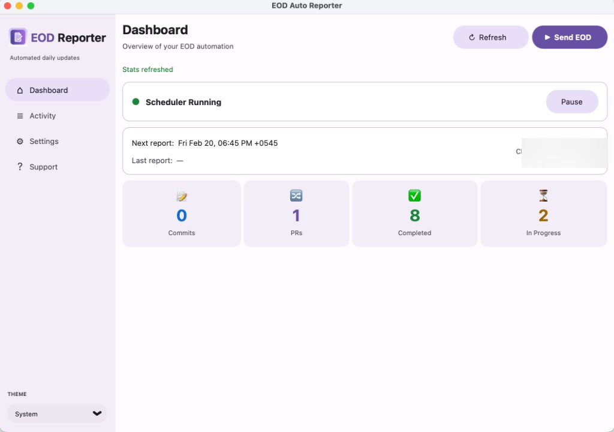
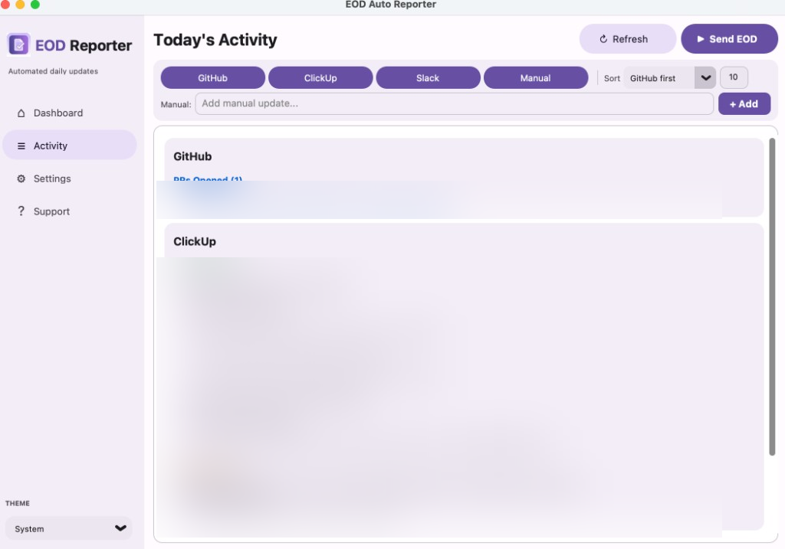
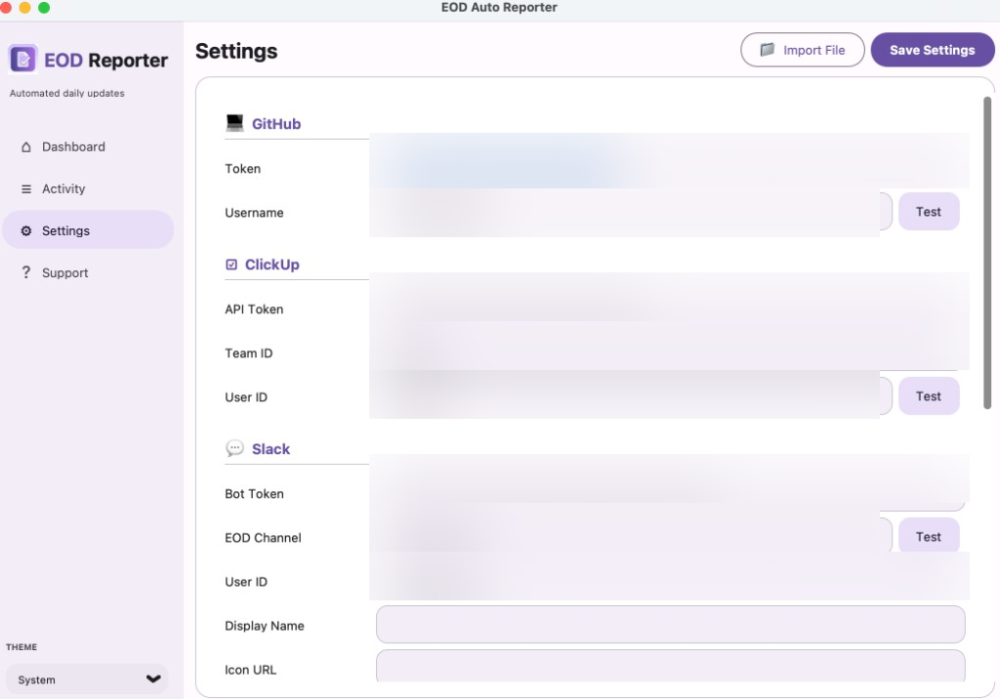
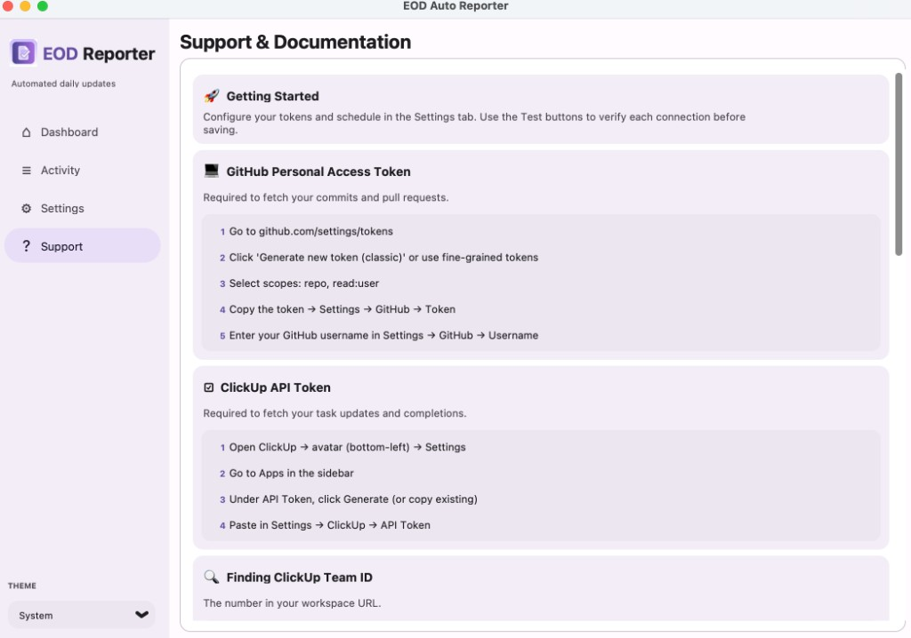

# EOD Auto Reporter

Automated End-of-Day summary generator that pulls activity from **GitHub**, **ClickUp**, and **Slack**, optionally summarizes it with **AI**, formats a clean report, and posts it to **Slack** — every weekday, hands-free.

Runs as a **cloud service** (FastAPI) or a **native macOS desktop app** (CustomTkinter).

> **Download the macOS app:** [EOD-Reporter-1.0.0.dmg](https://github.com/susylPearl/eod-auto-reporter/releases/download/v1.0.0/EOD-Reporter-1.0.0.dmg)

---

## Table of Contents

- [Features](#features)
- [Screenshots](#screenshots)
- [Project Structure](#project-structure)
- [Architecture](#architecture)
- [Prerequisites](#prerequisites)
- [Setup](#setup)
  - [Clone & Install](#1-clone--install)
  - [Configure Environment](#2-configure-environment)
  - [Run Locally](#3-run-locally)
  - [Run Tests](#4-run-tests)
- [Desktop App (macOS)](#desktop-app-macos)
  - [Running from Source](#running-from-source)
  - [Building a Standalone App](#building-a-standalone-app)
  - [Building a DMG](#building-a-dmg)
- [How to Get Your Tokens](#how-to-get-your-tokens)
  - [GitHub Personal Access Token](#github-personal-access-token)
  - [ClickUp API Token](#clickup-api-token)
  - [Slack Bot Setup](#slack-bot-setup)
  - [AI Summary (Optional)](#ai-summary-optional)
- [Configuration Reference](#configuration-reference)
- [API Endpoints](#api-endpoints)
- [Scheduler](#scheduler)
- [Deployment](#deployment)
  - [Docker](#docker)
  - [Render](#render)
  - [Railway](#railway)
  - [VPS (systemd)](#vps-systemd)
- [Example Output](#example-output)
- [Extending](#extending)
- [License](#license)

---

## Features

### Data Sources
- **GitHub** — today's commits (grouped by repo) and pull requests (opened & merged)
- **ClickUp** — task completions, status changes, in-progress items, and comments
- **Slack Channels** — monitors specified channels for today's discussions
- **Manual Updates** — add free-text items via the desktop UI

### Intelligence
- **AI Summarization** — optional per-channel Slack summaries and overall activity summary using Gemini, Groq, OpenAI, or any OpenAI-compatible API
- **OOO Detection** — automatically skips posting when your Slack status indicates out-of-office

### Report Delivery
- **Slack Block Kit** — posts beautifully formatted reports with rich text, grouping, and indentation
- **Scheduled Delivery** — runs Mon–Fri at your configured time via APScheduler
- **Manual Trigger** — send on-demand from the UI or via `POST /trigger-eod`

### Desktop App (macOS)
- **Dashboard** — scheduler status, next/last run, live stats (commits, PRs, tasks completed, in-progress)
- **Activity View** — real-time preview of today's activity with filters, search, and manual update editor
- **Settings** — GUI configuration with per-field test buttons, import from `.env`/JSON/text files
- **Material Design 3** — modern UI with light/dark theme, navigation rail, tonal buttons, and card-based layout
- **Background Scheduler** — continues running while the app is open, auto-restarts on failure
- **Standalone Build** — package as a `.app` bundle with custom icon, distribute as `.dmg`

### Cloud Mode (FastAPI)
- `GET /health` — health check with status, timestamp, and version
- `POST /trigger-eod` — manually trigger the EOD pipeline
- Auto-starts scheduler on boot
- Docker-ready with `Dockerfile` included

---

## Screenshots

### Dashboard
Scheduler status, next/last run times, and live stats at a glance.



### Activity
Real-time preview of today's GitHub, ClickUp, and Slack activity with source filters and manual updates.



### Settings
Configure all integrations with per-field test buttons. Import from `.env`, JSON, or text files.



### Support & Documentation
In-app setup guides and keyboard shortcuts.



---

## Project Structure

```
eod-auto-reporter/
├── app/                              # Core logic (shared by desktop & cloud)
│   ├── main.py                       # FastAPI app + lifespan (cloud entry point)
│   ├── config.py                     # Pydantic BaseSettings (env → typed config)
│   ├── logger.py                     # Centralized logging setup
│   ├── scheduler.py                  # APScheduler cron job + EOD pipeline
│   ├── models/
│   │   └── activity_models.py        # Pydantic models for GitHub, ClickUp, Slack data
│   └── services/
│       ├── github_service.py         # GitHub REST API v3 (events, search)
│       ├── clickup_service.py        # ClickUp API v2 (tasks, comments)
│       ├── slack_service.py          # Slack Web API (post, OOO check, identity)
│       ├── slack_activity_service.py # Slack channel message fetcher
│       ├── ai_summary_service.py     # AI summarization (OpenAI-compatible)
│       └── summary_service.py        # Slack Block Kit report builder
│
├── desktop/                          # macOS desktop app (CustomTkinter)
│   ├── main.py                       # Desktop entry point
│   ├── app_window.py                 # Main window, sidebar nav, theme switching
│   ├── config_store.py               # JSON config persistence + import
│   ├── service_bridge.py             # Config → os.environ bridge
│   ├── local_scheduler.py            # Background thread scheduler
│   ├── theme.py                      # Material Design 3 tokens + widget helpers
│   ├── utils.py                      # Scrollable frame fixes for macOS
│   ├── assets/
│   │   ├── icon.png                  # App logo (PNG)
│   │   └── icon.icns                 # macOS app bundle icon
│   └── views/
│       ├── dashboard_view.py         # Scheduler status, stats cards
│       ├── activity_view.py          # Activity preview, filters, manual updates
│       ├── settings_view.py          # Configuration form + test buttons
│       └── support_view.py           # Help, keyboard shortcuts, about
│
├── tests/                            # Unit tests (pytest)
│   ├── conftest.py                   # Shared fixtures
│   ├── test_api.py                   # FastAPI endpoint tests
│   ├── test_models.py                # Pydantic model tests
│   ├── test_scheduler.py             # Scheduler pipeline tests
│   ├── test_slack_service.py         # Slack service tests
│   └── test_summary_service.py       # Summary formatting tests
│
├── docs/
│   └── ARCHITECTURE.md               # Architecture & design documentation
│
├── setup_mac.py                      # py2app build configuration
├── build_dmg.sh                      # DMG packaging script
├── Dockerfile                        # Docker image for cloud deployment
├── requirements.txt                  # Core Python dependencies
├── requirements-desktop.txt          # Additional desktop dependencies
├── .env.example                      # Environment variable template
├── .gitignore
└── README.md
```

---

## Architecture

The project follows a **layered architecture** with clear separation:

```
┌─────────────────────────────────────────────────────────┐
│                    Entry Points                         │
│  ┌──────────────────┐    ┌───────────────────────────┐  │
│  │  FastAPI (cloud)  │    │  CustomTkinter (desktop)  │  │
│  │  app/main.py      │    │  desktop/main.py          │  │
│  └────────┬─────────┘    └──────────┬────────────────┘  │
│           │                         │                    │
│           ▼                         ▼                    │
│  ┌──────────────────────────────────────────────────┐   │
│  │              Scheduler Layer                      │   │
│  │  app/scheduler.py (pipeline orchestration)        │   │
│  │  desktop/local_scheduler.py (background thread)   │   │
│  └──────────────────────┬───────────────────────────┘   │
│                         │                                │
│                         ▼                                │
│  ┌──────────────────────────────────────────────────┐   │
│  │               Service Layer                       │   │
│  │  github_service  │  clickup_service               │   │
│  │  slack_service   │  slack_activity_service         │   │
│  │  ai_summary_service │ summary_service             │   │
│  └──────────────────────────────────────────────────┘   │
│                         │                                │
│                         ▼                                │
│  ┌──────────────────────────────────────────────────┐   │
│  │               Data Models                         │   │
│  │  Pydantic models for GitHub, ClickUp, Slack       │   │
│  └──────────────────────────────────────────────────┘   │
└─────────────────────────────────────────────────────────┘
```

**Data Flow:**
1. Scheduler triggers the EOD pipeline (cron or manual)
2. Pipeline checks OOO status via Slack
3. Fetches activity from GitHub, ClickUp, and Slack APIs
4. Optionally generates AI summaries
5. Formats everything into Slack Block Kit
6. Posts to the configured Slack channel

See [docs/ARCHITECTURE.md](docs/ARCHITECTURE.md) for the full design document.

---

## Prerequisites

- **Python 3.11+**
- **macOS 12+** (for the desktop app)
- A GitHub Personal Access Token
- A ClickUp API Token
- A Slack Bot Token
- (Optional) An OpenAI-compatible API key for AI summaries

---

## Setup

### 1. Clone & Install

```bash
git clone https://github.com/susylPearl/eod-auto-reporter.git
cd eod-auto-reporter
python3 -m venv .venv
source .venv/bin/activate
pip install -r requirements.txt
```

For the desktop app, also install:
```bash
pip install -r requirements-desktop.txt
```

### 2. Configure Environment

```bash
cp .env.example .env
```

Edit `.env` and fill in your tokens. See [How to Get Your Tokens](#how-to-get-your-tokens) for step-by-step guides.

### 3. Run Locally

**Cloud mode (FastAPI):**
```bash
uvicorn app.main:app --reload --port 8000
```

The scheduler starts automatically. Visit `http://localhost:8000/health` to verify.

**Desktop mode (macOS):**
```bash
python -m desktop.main
```

The desktop app has its own Settings view where you can configure everything through the GUI — no `.env` file needed.

### 4. Run Tests

```bash
pytest tests/ -v
```

---

## Desktop App (macOS)

The desktop app provides a full GUI for managing your EOD reports without touching config files or the command line.

### Views

| View | Description |
|------|-------------|
| **Dashboard** | Scheduler status (running/paused), next & last run times, live stats (commits, PRs, completed tasks, in-progress items), pause/resume controls |
| **Activity** | Real-time preview of today's GitHub, ClickUp, Slack, and manual activity. Filter by source, sort order, max commits per repo. Add/remove manual updates with chips. |
| **Settings** | Configure all tokens, IDs, scheduler time, AI model, and Slack channels. Per-field "Test" buttons verify each integration. Import config from `.env`, JSON, or text files. |
| **Support** | Keyboard shortcuts, status overview, and about information |

### Running from Source

```bash
source .venv/bin/activate
python -m desktop.main
```

On first launch, if a `.env` file exists in the project directory, the desktop app automatically imports its values into the local config store at `~/Library/Application Support/EOD Reporter/config.json`.

### Building a Standalone App

```bash
python setup_mac.py py2app
```

This creates `dist/EOD Reporter.app` — a self-contained macOS application bundle with the custom purple icon.

### Building a DMG

```bash
chmod +x build_dmg.sh
./build_dmg.sh
```

This runs the py2app build and packages the result into `dist/EOD-Reporter-1.0.0.dmg`. Open the DMG and drag **EOD Reporter** to Applications.

**Or download the pre-built DMG:** [EOD-Reporter-1.0.0.dmg](https://github.com/susylPearl/eod-auto-reporter/releases/download/v1.0.0/EOD-Reporter-1.0.0.dmg)

---

## How to Get Your Tokens

### GitHub Personal Access Token

1. Go to [github.com/settings/tokens](https://github.com/settings/tokens)
2. Click **Generate new token (classic)** or use fine-grained tokens
3. Select scopes: `repo`, `read:user`
4. Copy the token → set as `GITHUB_TOKEN`
5. Set `GITHUB_USERNAME` to your GitHub login

### ClickUp API Token

1. Open ClickUp → click your avatar (bottom-left) → **Settings**
2. Go to **Apps** in the sidebar
3. Under **API Token**, click **Generate** (or copy existing)
4. Copy the token → set as `CLICKUP_API_TOKEN`

**Finding Team ID:**
1. Open any ClickUp space in your browser
2. The URL looks like: `https://app.clickup.com/12345678/...`
3. The number after `app.clickup.com/` is your **Team ID**
4. Alternatively: `curl -H "Authorization: YOUR_TOKEN" https://api.clickup.com/api/v2/team`

**Finding User ID:**
1. Call: `curl -H "Authorization: YOUR_TOKEN" https://api.clickup.com/api/v2/team`
2. Find your user under `team.members[].user`
3. Your numeric `id` field is the **User ID**

### Slack Bot Setup

1. Go to [api.slack.com/apps](https://api.slack.com/apps)
2. Click **Create New App** → **From scratch**
3. Name it (e.g. "EOD Reporter") and pick your workspace
4. Go to **OAuth & Permissions** in the sidebar
5. Under **Bot Token Scopes**, add:
   - `chat:write` — post messages
   - `users.profile:read` — check OOO status
   - `channels:history` — read channel messages (for Slack activity monitoring)
   - `channels:read` — list channels
   - `users:read` — resolve user names
6. Click **Install to Workspace** and authorize
7. Copy the **Bot User OAuth Token** (`xoxb-...`) → set as `SLACK_BOT_TOKEN`
8. Invite the bot to your channel: `/invite @EOD Reporter`
9. Set `SLACK_CHANNEL` to the channel name (e.g. `#eod-updates`) or channel ID

### AI Summary (Optional)

The app supports any OpenAI-compatible API for generating activity summaries and Slack channel digests.

**Gemini (Google):**
1. Get an API key from [aistudio.google.com](https://aistudio.google.com/apikey)
2. Set `OPENAI_API_KEY` to your Gemini key
3. Set `AI_MODEL` to `gemini-2.0-flash` (or another Gemini model)
4. The base URL is automatically set to `https://generativelanguage.googleapis.com/v1beta/openai`

**Groq:**
1. Get a key from [console.groq.com](https://console.groq.com)
2. Set `OPENAI_API_KEY` to your Groq key
3. Set `AI_MODEL` to `llama-3.3-70b-versatile` (or another model)
4. Set `AI_BASE_URL` to `https://api.groq.com/openai/v1`

**OpenAI:**
1. Get a key from [platform.openai.com](https://platform.openai.com)
2. Set `OPENAI_API_KEY` to your key
3. Set `AI_MODEL` to `gpt-4o-mini` (or another model)
4. Leave `AI_BASE_URL` empty (uses default)

---

## Configuration Reference

All values can be set via environment variables (`.env`) or through the desktop app's Settings view.

| Variable | Required | Default | Description |
|----------|----------|---------|-------------|
| `GITHUB_TOKEN` | Yes | — | GitHub Personal Access Token |
| `GITHUB_USERNAME` | Yes | — | Your GitHub username |
| `CLICKUP_API_TOKEN` | Yes | — | ClickUp API token |
| `CLICKUP_TEAM_ID` | Yes | — | ClickUp workspace team ID |
| `CLICKUP_USER_ID` | Yes | — | Your ClickUp numeric user ID |
| `SLACK_BOT_TOKEN` | Yes | — | Slack Bot OAuth Token (`xoxb-...`) |
| `SLACK_CHANNEL` | Yes | — | Target Slack channel for EOD posts |
| `SLACK_USER_ID` | Yes | — | Your Slack user ID (`U0...`) |
| `SLACK_DISPLAY_NAME` | No | Auto | Display name override (auto-fetched) |
| `SLACK_ICON_URL` | No | Auto | Profile icon override (auto-fetched) |
| `REPORT_HOUR` | No | `18` | Scheduled hour (24h format) |
| `REPORT_MINUTE` | No | `0` | Scheduled minute |
| `TIMEZONE` | No | `Asia/Kathmandu` | IANA timezone for scheduling |
| `OPENAI_API_KEY` | No | — | API key for AI summarization |
| `AI_MODEL` | No | — | AI model name (e.g. `gemini-2.0-flash`) |
| `AI_BASE_URL` | No | — | Custom API base URL |
| `SLACK_MONITOR_CHANNELS` | No | — | Comma-separated channel names to monitor |
| `LOG_LEVEL` | No | `INFO` | Logging level |
| `APP_ENV` | No | `production` | `production` or `development` |

**Desktop-only settings** (configured in the GUI):
| Setting | Description |
|---------|-------------|
| Show GitHub / ClickUp / Slack / Manual | Toggle which sources appear in Activity view and EOD report |
| Activity Section Order | GitHub first or ClickUp first |
| Max Commits Per Repo | Limit displayed commits |
| Manual Updates | Free-text items added to the report |

---

## API Endpoints

| Method | Path | Description |
|--------|------|-------------|
| `GET` | `/health` | Returns status, timestamp, and version |
| `POST` | `/trigger-eod` | Manually trigger the EOD pipeline |

**Example:**

```bash
curl -X POST http://localhost:8000/trigger-eod
```

```json
{
  "status": "accepted",
  "message": "EOD pipeline has been triggered and is running in the background."
}
```

---

## Scheduler

The report runs automatically **Monday–Friday** at your configured time.

| Setting | Default | Description |
|---------|---------|-------------|
| `REPORT_HOUR` | `18` | Hour in 24h format |
| `REPORT_MINUTE` | `0` | Minute |
| `TIMEZONE` | `Asia/Kathmandu` | IANA timezone |

**Cloud mode** uses APScheduler's `AsyncIOScheduler` with `CronTrigger(day_of_week='mon-fri')`.

**Desktop mode** uses APScheduler's `BackgroundScheduler` running in a daemon thread. The scheduler auto-restarts if the thread dies, and can be paused/resumed from the Dashboard.

---

## Deployment

### Docker

```bash
docker build -t eod-auto-reporter .
docker run -d --env-file .env -p 8000:8000 eod-auto-reporter
```

### Render

1. Create a new **Web Service** on [render.com](https://render.com)
2. Connect your GitHub repo
3. Set **Build Command**: `pip install -r requirements.txt`
4. Set **Start Command**: `uvicorn app.main:app --host 0.0.0.0 --port $PORT`
5. Add all environment variables from `.env.example`
6. Deploy

### Railway

1. Create a new project on [railway.app](https://railway.app)
2. Connect your GitHub repo
3. Railway auto-detects the `Dockerfile`, or set:
   - **Start Command**: `uvicorn app.main:app --host 0.0.0.0 --port $PORT`
4. Add environment variables in the Railway dashboard
5. Deploy

### VPS (systemd)

```bash
# /etc/systemd/system/eod-reporter.service
[Unit]
Description=EOD Auto Reporter
After=network.target

[Service]
User=deploy
WorkingDirectory=/opt/eod-auto-reporter
EnvironmentFile=/opt/eod-auto-reporter/.env
ExecStart=/opt/eod-auto-reporter/.venv/bin/uvicorn app.main:app --host 0.0.0.0 --port 8000
Restart=always
RestartSec=5

[Install]
WantedBy=multi-user.target
```

```bash
sudo systemctl enable eod-reporter
sudo systemctl start eod-reporter
```

---

## Example Output

```
📌 EOD Update — Friday, February 13 2026

🚀 Development
Commits
  • abc1234 fix: resolve flaky test  (backend)
  • def5678 feat: add caching layer  (backend)
PRs Merged
  • #42 Add caching layer  (backend)

📋 ClickUp Updates
Completed
  • Write unit tests → done
Status Changes
  • Implement auth → review

💬 Slack Highlights
#dev-general — Discussed deployment strategy and CI/CD pipeline updates.
#design — Reviewed new dashboard mockups.

📝 Manual Updates
  • Attended sprint retrospective
  • Reviewed PR #38 offline

✅ Focus Summary
Focused on 2 commits, 1 PR, 1 task completed today.
```

---

## Extending

This project is designed to be extended:

- **New Data Sources** — add a service in `app/services/` following the existing pattern (fetch → model → return)
- **AI Providers** — any OpenAI-compatible API works out of the box via `ai_summary_service.py`
- **Google Calendar OOO** — add a calendar check in `scheduler.py` before the Slack OOO guard
- **Multiple Channels** — support per-team or per-project Slack channels
- **Web Dashboard** — add a frontend to view past reports
- **Notifications** — add email/Teams/Discord delivery alongside Slack

---

## License

MIT
